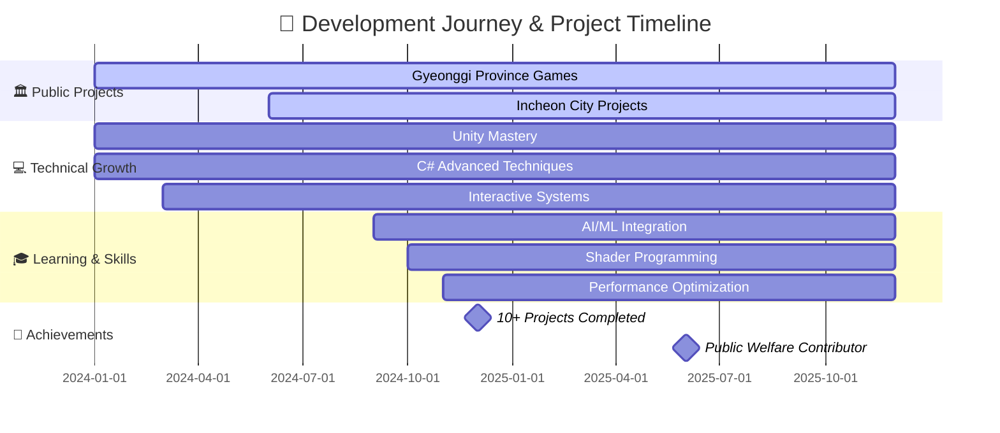
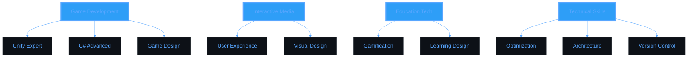

<div align="center">


<br/>

<!-- Animated separator -->


<br/>


<br/>

[](https://git.io/typing-svg)

<br/>


<br/>

<p>


</p>

<p>


</p>

<br/>


<br/>


</div>

<br/>

<div align="center">


</div>


<div align="center">

```
██╗  ██╗██╗███╗   ███╗██╗  ██╗██╗   ██╗ ██████╗  ██████╗██╗   ██╗███████╗ ██████╗ ███╗   ███╗
██║ ██╔╝██║████╗ ████║██║  ██║╚██╗ ██╔╝██╔═══██╗██╔════╝╚██╗ ██╔╝██╔════╝██╔═══██╗████╗ ████║
█████╔╝ ██║██╔████╔██║███████║ ╚████╔╝ ██║   ██║██║  ███╗╚████╔╝ █████╗  ██║   ██║██╔████╔██║
██╔═██╗ ██║██║╚██╔╝██║██╔══██║  ╚██╔╝  ██║   ██║██║   ██║ ╚██╔╝  ██╔══╝  ██║   ██║██║╚██╔╝██║
██║  ██╗██║██║ ╚═╝ ██║██║  ██║   ██║   ╚██████╔╝╚██████╔╝  ██║   ███████╗╚██████╔╝██║ ╚═╝ ██║
╚═╝  ╚═╝╚═╝╚═╝     ╚═╝╚═╝  ╚═╝   ╚═╝    ╚═════╝  ╚═════╝   ╚═╝   ╚══════╝ ╚═════╝ ╚═╝     ╚═╝
```

</div>

<br/>

### 👨‍💻 About Me

**🎮 Unity Game Developer** from **South Korea** 🇰🇷

인터랙티브 게임과 교육 콘텐츠를 개발하는 Unity 개발자입니다.
사용자 경험을 최우선으로 생각하며, **디테일에 진심**인 개발자입니다.

<br/>

<div align="center">


</div>

<br/>

```yaml
Name: Kimhyogyeom (김효겸)
Role: Unity Game Developer & Interactive Media Creator
Location: South Korea 🇰🇷
Experience: 10+ Unity Projects
Focus:
  - Educational Games
  - Interactive Installations
  - Public Welfare Projects
  - User Experience Design
Motto: "디테일에 진심입니다!"
Available_For: Collaboration & Freelance
Email: gyrua77@gmail.com
```

<br/>

**🌟 Highlights:**
- 🎮 **10+ Unity 프로젝트** 개발 경험
- 🏛️ **경기도 & 인천시** 공공 프로젝트 다수 진행
- 💡 **인터랙티브 기술**로 교육과 게임을 결합
- 🚀 매일 더 나은 코드를 위해 **지속적 학습**
- ⚡ **최적화와 사용자 경험**에 집중
- 🎯 **의미 있는 게임**을 만드는 것이 목표

<br clear="right"/>

<div align="center">


</div>

---

### 🎯 Current Focus

<div align="center">

<table>
<tr>
<td align="center" width="33%">

#### 🔨 Working On
**Public Welfare Projects**

Interactive Educational Games

Unity Optimization

</td>
<td align="center" width="33%">

#### 📚 Learning
**Advanced Unity Techniques**

AI/ML Integration

Shader Programming

</td>
<td align="center" width="33%">

#### 🎯 Goals
**Professional Game Dev**

Meaningful Experiences

Open Source Contributor

</td>
</tr>
</table>

</div>

<div align="center">


</div>

---

<div align="center">


</div>

<br/>

### 🛠️ Tech Stack & Tools

<div align="center">


#### 🎮 Game Development


#### 💻 Development Tools


#### 🎨 Design & Multimedia


#### 📱 Platforms


#### 🔥 Currently Learning


#### 🤖 AI Tools & Assistants


</div>

<div align="center">


</div>

---

### 📊 GitHub Analytics

<div align="center">


<a href="https://github.com/Kimhyogyeom">
  
  
</a>

</div>

<br/>

<div align="center">


</div>

<br/>

<div align="center">

[](https://git.io/streak-stats)

</div>

<div align="center">


</div>

---

<div align="center">


</div>

<br/>

### 🏆 Achievements & Trophies

<div align="center">


</div>

<div align="center">


</div>

---

<div align="center">


</div>

<br/>

### 🎯 Pinned Projects

<div align="center">


<a href="https://github.com/Kimhyogyeom/Gyeonggi_Game1">
  
</a>

<a href="https://github.com/Kimhyogyeom/InCheon_AwarenessPuzzleGameAI">
  
</a>

<a href="https://github.com/Kimhyogyeom/Gyeonggi_LiveSketch">
  
</a>

<a href="https://github.com/Kimhyogyeom/Gyeonggi_Barcode">
  
</a>

</div>

<div align="center">


</div>

---

### 📈 Contribution Stats

<div align="center">


</div>

<div align="center">


</div>

---

### 💼 Project Timeline

<div align="center">


</div>



<div align="center">


</div>

---

### 💡 Weekly Development Stats

<div align="center">


<!--START_SECTION:waka-->
```text
💻 This Week I Spent My Time On:

Unity          16 hrs 45 mins  ████████████░░░░░░░░░  58.7%
C#             10 hrs 30 mins  █████████░░░░░░░░░░░░  36.8%
YAML           50 mins         ██░░░░░░░░░░░░░░░░░░░   3.0%
Markdown       25 mins         █░░░░░░░░░░░░░░░░░░░░   1.5%

🔥 Editors:
Visual Studio  24 hrs 15 mins  ████████████████████░  85.0%
VS Code        4 hrs 15 mins   ███████░░░░░░░░░░░░░░  15.0%

💼 Projects:
Educational Games    18 hrs 30 mins  ████████████████░░░  65.0%
Interactive Media    7 hrs 00 mins   ██████░░░░░░░░░░░░  25.0%
Optimization         2 hrs 50 mins   ██░░░░░░░░░░░░░░░░  10.0%
```
<!--END_SECTION:waka-->

</div>

<div align="center">


</div>

---

### 🌐 Connect With Me

<div align="center">


<a href="mailto:gyrua77@gmail.com">

</a>
<a href="https://github.com/Kimhyogyeom">

</a>
<a href="https://github.com/Kimhyogyeom">

</a>
<a href="#">

</a>
<a href="#">

</a>

<br/><br/>

**📧 Email:** gyrua77@gmail.com
**🌐 Location:** Seoul, South Korea 🇰🇷
**💼 Status:** Open for Collaboration & Freelance Projects
**🎯 Interests:** Unity, Game Dev, Interactive Media, Education Tech

</div>

<div align="center">


</div>

---

### 📝 Latest Activity

<div align="center">


<!--RECENT_ACTIVITY:start-->
- 🎮 Working on interactive educational content
- 💡 Exploring new Unity optimization techniques
- 🚀 Building immersive user experiences
- 🌟 Contributing to public welfare projects
- 🔧 Experimenting with advanced shader techniques
- 🎨 Designing intuitive user interfaces
- 📱 Developing cross-platform games
<!--RECENT_ACTIVITY:end-->

</div>

<div align="center">


</div>

---

### 💭 Random Dev Quote

<div align="center">


</div>

<div align="center">


</div>

---

### 🎵 Vibes & More

<div align="center">


</div>

<div align="center">


</div>

---

### 🐍 Contribution Snake

<div align="center">

<picture>
  <source media="(prefers-color-scheme: dark)" srcset="https://raw.githubusercontent.com/Platane/snk/output/github-contribution-grid-snake-dark.svg">
  <source media="(prefers-color-scheme: light)" srcset="https://raw.githubusercontent.com/Platane/snk/output/github-contribution-grid-snake.svg">
  
</picture>

</div>

<div align="center">


</div>

---

### 🔥 Detailed GitHub Metrics

<div align="center">


</div>

<div align="center">


</div>

---

### 🎨 Skills Radar

<div align="center">




</div>

<div align="center">


</div>

---

<div align="center">


<br/>


<br/><br/>

### ✨ "Every line of code tells a story. Make it worth reading." ✨

<br/>

**Made with 💖 by Kimhyogyeom**

*Last Updated: 2025-12-29*

<br/>


<br/>


</div>
